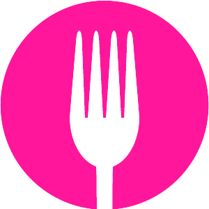

# Title of My Application

<p align="center">
  
</p>

## About

Fast Dinner is the implementation of a restaurant menu Web application that promises to deliver your order in 6 minutes! (Didn't want to work in this kitchen, thank goodness I'm just the dev.)

You can choose the menu items you want to order: food, drink and dessert. The quantity of each item can be changed, and when selecting items from each of the categories the order confirmation button is enabled.

When clicking on confirm order, the customer is directed to the page that details the order items, quantities, values and the total amount of the order. If you change your mind, you can cancel and return to the main page.

If everything is fine, just confirm and you will be directed to the company's whatsapp with the order description, where the last purchase and delivery details can be arranged.


<!-- ## Preview

um gif da aplicação bem maneiro -->


## Deployment

<p align="center"><a  src="fast-dinner.vercel.app/">fast-dinner.vercel.app/</a></p>


## Features 

- [x] choose food, drink and dessert
- [x] choose the quantity of each item
- [x] review order before confirmation
- [x] confirm order
- [x] send the detailed request to whatsapp automatically
- [x] beautiful choice of color palette


## How to run 

```bash
# Clone this repository
$ git clone <https://github.com/rabbithay/fast-dinner.git>

# Access the project folder cmd/terminal
$ cd fast-dinner

# Install the dependencies
$ npm install

# Compile the code
$ npm run build

# Run the application 
$ npm start

# The server will automatically start at localhost:3000/ on your favorite browser 
```

## Tech Stack


<p align="center">


</p>


<!-- 
### Contact

### Acknowledgements -->
